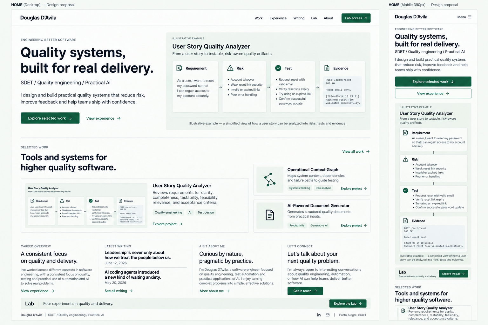
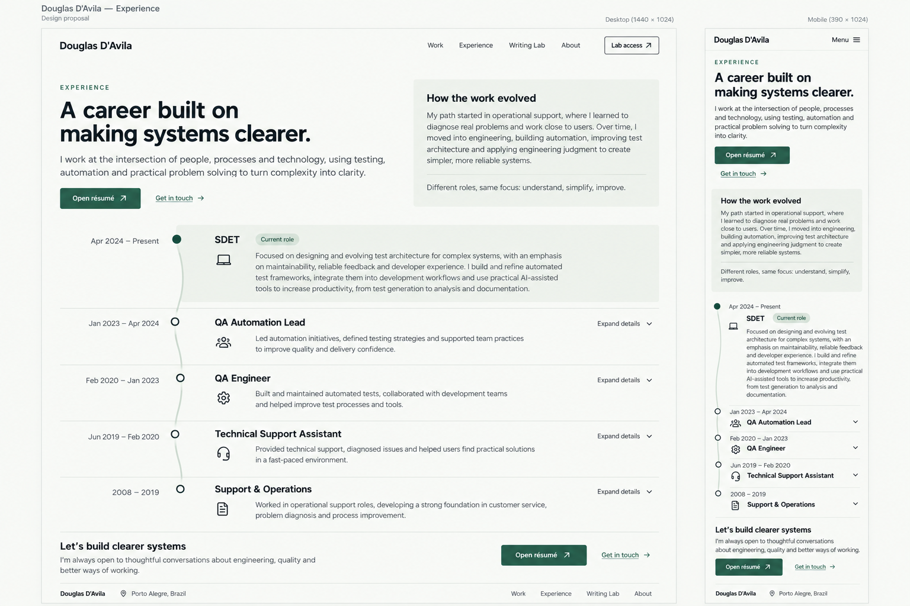
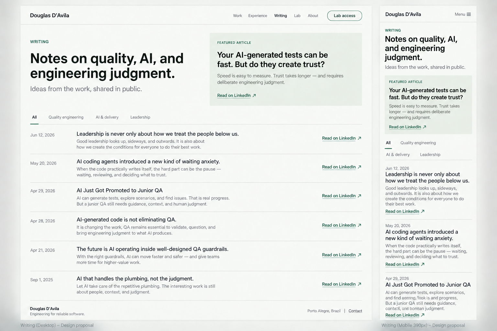
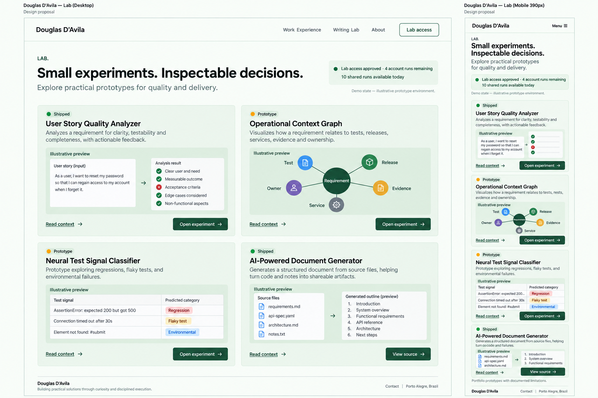
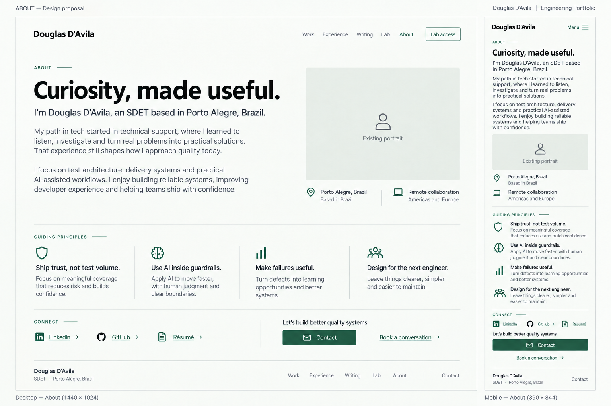
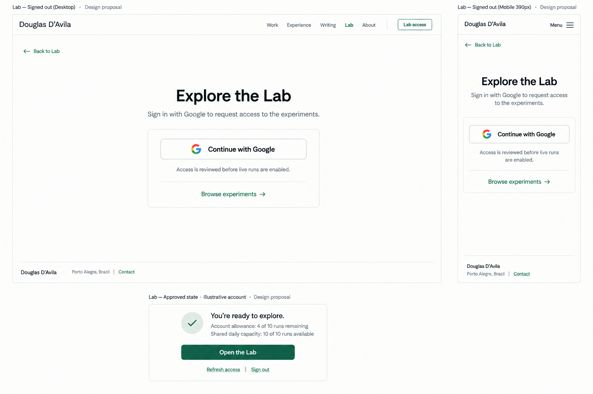

# Portfolio — six individual page designs

Proposed minimalist light theme for recruiters and tech, engineering, and QA leaders. Each board includes desktop and mobile treatment. These are static design proposals; the website has not been implemented or changed by this work.

Read [analysis and implementation plan](README.md) for the full content sequence, navigation, motion, responsive rules, and account-state matrix. Read [visual review](visual-review.md) for factual and rendering details to preserve during implementation.

## 1. Home / Work

Role and inspectable evidence first; selected projects and connected narrative sections follow.

## 2. Experience

A readable career timeline with inline details and a prominent résumé action.

## 3. Writing

One featured piece and a compact editorial index with explicit LinkedIn destinations.

## 4. Lab

Distinct experiment previews, visible maturity labels, and compact access status.

## 5. About

A short personal introduction, existing portrait placement, principles, and professional links.

## 6. Lab access

A focused sign-in flow, plus an approved-state treatment with separate account and shared daily allowances.

